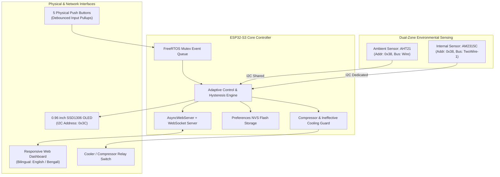

# HCBM: Smart Cooler Controller & Climate Management System

[](https://platformio.org/)
[](https://espressif.com/)
[](https://www.espressif.com/en/products/socs/esp32-s3)
[](LICENSE)
[]()
[](https://wokwi.com/)

**HCBM (Smart Cooler Controller)** is an intelligent, IoT-enabled environmental cooling controller built on the **ESP32-S3**. Designed for smart coolers, chambers, wine cellars, dry boxes, and refrigeration units, HCBM pairs dual-zone temperature & humidity sensing with an ambient-aware adaptive control engine, compressor safety protection, an onboard OLED/5-button physical interface, and a WebSocket-powered web dashboard.

---

## 📑 Table of Contents
- [Core Architecture](#-core-architecture)
- [Key Features](#-key-features)
- [Hardware & Pinout](#-hardware--pinout)
- [Adaptive Control Engine](#-adaptive-control-engine)
- [Safety & Equipment Protection](#-safety--equipment-protection)
- [Physical User Interface (OLED & Buttons)](#-physical-user-interface-oled--buttons)
- [Web Dashboard & API](#-web-dashboard--api)
- [Sensor Calibration](#-sensor-calibration)
- [Configuration Reference (`config.h`)](#-configuration-reference-configh)
- [Getting Started & Installation](#-getting-started--installation)
- [Wokwi Simulation](#-wokwi-simulation)
- [Project Structure](#-project-structure)
- [Author & Credits](#-author--credits)

---

## 🧠 Core Architecture



---

## ✨ Key Features

- **Dual I2C Hardware Bus (No Multiplexer Needed)**:
  - Connects two sensors sharing the exact same I2C address (`0x38`) by taking advantage of the ESP32-S3's dual hardware I2C controllers (`Wire` and `TwoWire(1)`).
  - Ambient sensor: **AHT21** (shared bus with OLED).
  - Internal chamber sensor: **AM2315C** (AHT20 encased probe on a secondary bus).
- **Ambient-Aware Adaptive Hysteresis**:
  - Automatically adjusts cooling targets according to ambient conditions. If ambient air heats up above your configured thresholds, the system dynamically shifts the cooling upper threshold to avoid futile running.
- **Three Operating Modes**:
  1. **Auto Mode**: Intelligent hysteresis regulation prioritizing Temperature, Humidity, or Both.
  2. **Manual Mode**: Direct override via onboard hardware buttons or web toggle.
  3. **Timer Mode**: Scheduled cyclical cooling intervals with automated countdown and toggle.
- **Compressor Anti-Short-Cycle & Stall Protection**:
  - Enforces a minimum resting time (`MIN_OFF_TIME_MS`, default 3 minutes) before a compressor can be restarted, protecting against head pressure buildup and thermal trip.
- **Cooling Inefficiency Detection (Auto-Off)**:
  - If the internal temperature/humidity does not reduce toward ambient over an extended period (default 11 minutes), the system flags ineffective cooling and powers down to prevent compressor burnout and power waste.
- **Zero-Polling Realtime Web Dashboard**:
  - Built with `ESPAsyncWebServer` and WebSocket (`/ws`) for sub-second telemetry and responsive controls.
  - Bilingual UI with language switching (**English** and **Bengali / বাংলা**).
- **Self-Healing WiFi & Captive Portal**:
  - Auto-connects to saved networks with non-blocking retry.
  - Automatically spins up an Access Point (`SmartCooler_Setup`) with a captive onboarding wizard (`/setup`) if no credentials exist or on long-press button reset.
- **Full State Persistence (ESP32 Preferences / NVS)**:
  - Target temperatures, humidities, modes, priorities, calibration offsets, and WiFi credentials remain saved across reboots and power outages.

---

## 🔌 Hardware & Pinout

### ESP32-S3 DevKit Wiring Table

| Component | Function / Pin | ESP32-S3 GPIO | Note |
|---|---|---|---|
| **OLED Display** | I2C SDA | **GPIO 8** | SSD1306 (128×64, Addr `0x3C`) |
| **OLED Display** | I2C SCL | **GPIO 9** | Shared I2C Bus 0 |
| **Ambient Sensor (AHT21)** | I2C SDA | **GPIO 8** | Shared with OLED (Addr `0x38`) |
| **Ambient Sensor (AHT21)** | I2C SCL | **GPIO 9** | Shared with OLED |
| **Internal Sensor (AM2315C)** | I2C SDA | **GPIO 7** | Secondary Hardware I2C Bus 1 |
| **Internal Sensor (AM2315C)** | I2C SCL | **GPIO 6** | Avoids address conflict with AHT21 |
| **Cooler / Compressor Relay** | Relay Signal (`IN`) | **GPIO 15** | Active HIGH / LOW output driver |
| **Button: TOP** | WiFi Toggle / Reset | **GPIO 13** | `INPUT_PULLUP` (Active LOW) |
| **Button: MID** | Edit Mode / Confirm | **GPIO 12** | `INPUT_PULLUP` (Active LOW) |
| **Button: BOTTOM** | Manual Relay Toggle | **GPIO 10** | `INPUT_PULLUP` (Active LOW) |
| **Button: LEFT** | Priority Cycle / Value - | **GPIO 14** | `INPUT_PULLUP` (Active LOW) |
| **Button: RIGHT** | Mode Cycle / Value + | **GPIO 11** | `INPUT_PULLUP` (Active LOW) |
| **Power Bus** | VCC / GND | **3.3V / 5V / GND**| Relay powered by 5V, sensors on 3.3V |

---

## ⚙️ Adaptive Control Engine

Conventional cooling controllers turn on/off at fixed static setpoints. HCBM implements **Ambient-Aware Control**:

$$\text{Calculated Upper Temp} = \max(\text{Configured Upper Temp}, \text{Ambient Temp} + 1.5^\circ\text{C})$$
$$\text{Calculated Upper Hum} = \max(\text{Configured Upper Hum}, \text{Ambient Hum} + 3.0\%)$$

$$\text{Calculated Lower Temp} = \max(\text{Configured Lower Temp}, \text{Ambient Temp})$$
$$\text{Calculated Lower Hum} = \max(\text{Configured Lower Hum}, \text{Ambient Hum})$$

A minimum deadband gap is strictly enforced:
- **Temperature Gap**: Minimum $1.5^\circ\text{C}$ between upper and lower thresholds.
- **Humidity Gap**: Minimum $3.0\%$ between upper and lower thresholds.

### Priority Selection (Auto Mode)
- **Temperature Priority**: Relay engages only when internal temperature exceeds calculated upper threshold, and disengages when below calculated lower threshold.
- **Humidity Priority**: Relay regulates solely according to chamber humidity.
- **Both (Dual Priority)**: Relay engages if either parameter exceeds threshold and disengages when both reach safe targets.

---

## 🛡️ Safety & Equipment Protection

1. **Compressor Short-Cycle Delay (`MIN_OFF_TIME_MS`)**:
   - Standard refrigeration compressors cannot start against high head pressure.
   - When the relay switches OFF, a 180-second countdown lock begins. Any turn-on request during this window (automatic, web, or button) is safely blocked and status `PROTECT: xxs` is displayed on the screen and web UI.
2. **Thermal Inefficacy Auto-Shutdown (`STABLE_TIME_MS`)**:
   - If the compressor is running continuously but internal chamber conditions stabilize within $1^\circ\text{C}$ / $2\%$ of ambient air for over 11 minutes (e.g., door left open, refrigerant leak, ambient heat overload), the relay automatically disconnects to prevent compressor burning.
3. **I2C Bus Health Watchdog**:
   - If a sensor fails to respond for 5 consecutive read cycles, the system logs a critical warning and automatically executes an on-the-fly bus reset and re-scan.

---

## 🖥️ Physical User Interface (OLED & Buttons)

The 0.96" OLED provides an at-a-glance status overview:

```text
┌──────────────────────────┐
│ T:25-35C  H:45-75%       │ <-- Configured Setpoints
│ NT:27-36C NH:50-78%      │ <-- Ambient-Adapted Setpoints
│ Mode:AUTO(TEMP)   OFF    │ <-- Active Mode & Relay Status
│ Int T:26C H:52%          │ <-- Chamber Conditions
│ Amb T:28C H:55%          │ <-- External Ambient Conditions
│ PROTECT: 142s            │ <-- Compressor Lock Status
└──────────────────────────┘
```

### Button Navigation Matrix

| Button | Normal Mode Action | Edit Mode Action |
|---|---|---|
| **TOP (GPIO 13)** | **Short press**: Toggle WiFi status screen<br/>**Hold 10s**: Factory WiFi reset -> Hotspot mode | Select Previous Parameter |
| **MID (GPIO 12)** | Enter Edit Mode | Confirm & Save changes to flash |
| **BOTTOM (GPIO 10)** | Manual Relay Toggle (Condition-aware in Auto) | Select Next Parameter |
| **LEFT (GPIO 14)** | Cycle Priority (`Temperature` $\rightarrow$ `Humidity` $\rightarrow$ `Both`) | Decrease selected value ($-0.5^\circ\text{C}$ / $-1\%$) |
| **RIGHT (GPIO 11)** | Cycle Mode (`Auto` $\rightarrow$ `Manual` $\rightarrow$ `Timer`) | Increase selected value ($+0.5^\circ\text{C}$ / $+1\%$) |

---

## 🌐 Web Dashboard & API

When connected to WiFi (or in Hotspot mode), navigate to `http://<device-ip>/`.

### Endpoints Overview

| Endpoint | Method | Description |
|---|---|---|
| `/` | `GET` | Interactive bilingual web dashboard (English & Bengali) |
| `/setup` | `GET` | WiFi configuration and network provisioning portal |
| `/scan` | `GET` | Scans and returns available 2.4 GHz WiFi SSIDs (JSON) |
| `/setwifi` | `POST` | Sets new WiFi credentials and triggers automated reboot |
| `/data` | `GET` | Full JSON state snapshot (ambient, internal, thresholds, mode, protection) |
| `/ws` | `WebSocket` | Real-time bidirectional telemetry stream |
| `/relay?state=1\|0` | `GET` | Switches relay ON / OFF (respects compressor protection) |
| `/mode?set=1\|2\|3` | `GET` | Changes operating mode (`1`: Auto, `2`: Manual, `3`: Timer) |
| `/priority?set=...` | `GET` | Sets priority (`Temperature`, `Humidity`, `None`) |
| `/save` | `POST` | Updates thresholds and timer duration in flash |
| `/calibrate` | `GET` | Triggers internal sensor auto-calibration routine against ambient sensor |
| `/setoffsets` | `GET` | Sets manual sensor offsets (`?temp=x.xx&hum=y.yy`) |
| `/resetcalibrate`| `GET` | Resets sensor calibration offsets to 0.0 |
| `/setlang?lang=...`| `GET` | Sets language preference (`en` or `bn`) |

---

## 🎯 Sensor Calibration

Because different sensor housings experience thermal gradients, HCBM includes built-in sensor calibration:
1. Place both sensors side-by-side in still air.
2. Navigate to `http://<device-ip>/calibrate` or click **Auto Calibrate** in the web dashboard.
3. The controller gathers 5 sequential sample pairs, computes average delta differences, stores offsets in NVS flash, and automatically corrects future readings.

---

## ⚙️ Configuration Reference (`config.h`)

All core system behaviors are adjustable at compile-time in [`include/config.h`](include/config.h):

```cpp
#define DEBUG_MODE true                    // Enable/disable serial debugging
#define ENABLE_COMPRESSOR_PROTECTION true  // Enforce compressor rest delay
#define MIN_OFF_TIME_MS 180000             // Minimum off time (3 minutes)
#define ENABLE_AUTO_OFF_STABLE true        // Ineffective cooling auto-shutdown
#define STABLE_TIME_MS 660000              // Stable duration before auto-off (11 min)

#define AP_SSID "SmartCooler_Setup"        // Fallback Hotspot Name
#define AP_PASSWORD "12345678"             // Fallback Hotspot Password

#define DEFAULT_UPPER_TEMP 35.0            // Upper temperature target (°C)
#define DEFAULT_LOWER_TEMP 25.0            // Lower temperature target (°C)
#define DEFAULT_UPPER_HUM 75.0             // Upper humidity target (%)
#define DEFAULT_LOWER_HUM 45.0             // Lower humidity target (%)
#define DEFAULT_TIMER_VALUE 10             // Default timer mode duration (minutes)
```

---

## 🚀 Getting Started & Installation

### Prerequisites
- [PlatformIO IDE](https://platformio.org/) (VS Code Extension) or PlatformIO Core CLI.
- ESP32-S3 Development Board (e.g., `esp32-s3-devkitm-1` or `esp32-s3-devkitc-1`).
- USB-C cable for flashing and serial monitoring.

### 1. Clone the Repository
```bash
git clone https://github.com/LoNE-W0LvES/HCBM.git
cd HCBM
```

### 2. Build Firmware
```bash
# Using PlatformIO CLI
pio run
```

### 3. Upload to ESP32-S3
Connect your ESP32-S3 board via USB and run:
```bash
pio run --target upload
```

### 4. Open Serial Monitor
```bash
pio device monitor -b 115200
```

---

## 🧪 Wokwi Simulation

This repository includes simulation definitions for instant browser testing without physical hardware:
- [`diagram.json`](diagram.json): Complete circuit wiring for ESP32-S3, OLED, DHT22/AHT, relay, and push buttons.
- [`wokwi.toml`](wokwi.toml): PlatformIO firmware compilation mapping with web port forwarding to `http://localhost:8180`.

Open the project in VS Code with the **Wokwi Simulator** extension installed and press `F1` $\rightarrow$ `Wokwi: Start Simulator`.

---

## 📁 Project Structure

```text
├── include/
│   ├── buttons.h          # Button interface definitions
│   ├── config.h           # System timing, pinout, & threshold constants
│   ├── control_logic.h    # Adaptive control engine headers
│   ├── display.h          # SSD1306 OLED screens & rendering routines
│   ├── events.h           # Thread-safe FreeRTOS event queue & structs
│   ├── html_pages.h       # PROGMEM HTML/CSS/JS web templates
│   ├── sensor_read.h      # Dual-I2C sensor read & calibration declarations
│   ├── storage_manager.h  # Preferences flash storage manager
│   ├── variables.h        # Global runtime state declarations
│   ├── web_config.h       # AsyncWebServer & WebSocket handlers
│   └── wifi_manager.h     # WiFi connection manager & captive portal
├── src/
│   ├── buttons.cpp        # 5-button debounced input & edit mode handlers
│   ├── control_logic.cpp  # Hysteresis, compressor protection, & auto-off
│   ├── display.cpp        # OLED graphics, real-time UI, and WiFi info screen
│   ├── html_pages.cpp     # Complete responsive Web Dashboard & Setup UI
│   ├── main.cpp           # Setup, loop scheduler, and threshold calculations
│   ├── sensor_read.cpp    # Dual-bus AHT21 + AM2315C driver & calibration
│   ├── storage_manager.cpp# Persistent NVS read/write implementation
│   ├── web_config.cpp     # HTTP REST routes and WebSocket data emitter
│   └── wifi_manager.cpp   # Station client + AP fallback state machine
├── diagram.json           # Wokwi simulation diagram
├── platformio.ini         # PlatformIO build configuration & dependencies
└── wokwi.toml             # Wokwi simulation port-forward configuration
```

---

## 👨‍💻 Author & Credits

- **Author**: MD. Nafiur Rahman ([@LoNE-W0LvES](https://github.com/LoNE-W0LvES))
- **Project**: HCBM (Hybrid Cooler Controller & Board Module)
- **License**: Open source under the [MIT License](LICENSE).
